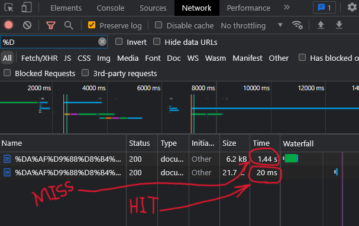
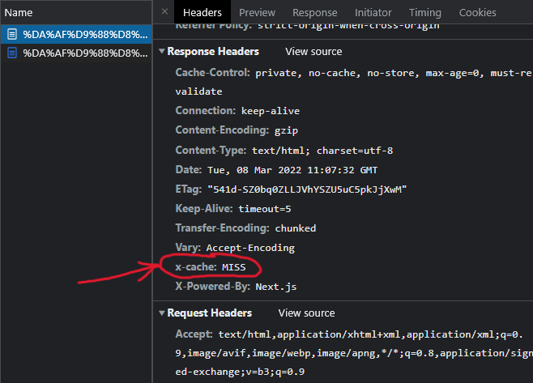
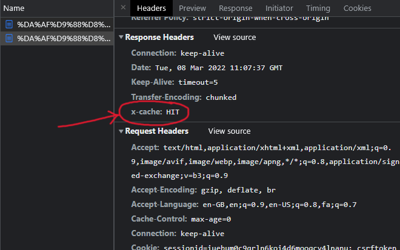

### به نام خدا

## پاسخ سوال عملی مصاحبه ترب

## توضیحات سوال اول:

- در خصوص حل این بخش از سوال، کامپوننت ها، کانتینر ها و پیج هایی توسعه داده شده اند.

- صفحات اصلی یعنی صفحه محصولات و صفحه دسته بندی ها در قسمت های مطلوب پیاده سازی شدند.

- در راستای آسان سازی پروسه دولوپمنت، برای کامپوننت ها، propTypes های مخصوص هر کامپوننت به آن اضافه شدند تا دولوپر ها بتوانند متوجه شوند که هر کامپوننتی چه prop هایی نیاز دارد و اینکه هر prop از چه نوعی است.

- یک CustomHook برای صفحات محصولات و دسته بندی ها پیاده سازی شده است و نام آن useInfiniteFetch می باشد.

  این کاستوم هوک در جاهایی کاربرد دارد که لیست های بینهایت داریم و قرار است با اسکرول کردن کاربر، هر بار دیتای جدید از سرور دریافت شده و نمایش داده شود.

- در خصوص کامپوننت های TitleBar و BottomNavigation، حالت استاندارد تر به این صورت است که از layout ها استفاده شود. منتهی چون در این پروژه فقط قسمتی از یک پروژه بزرگ مد نظر بوده و معماری کل صفحات واضح نیست، از این رو در داخل صفحات از این کامپوننت ها استفاده کردم و برای آن ها layout مخصوص پیاده سازی نکردم.

- در پیاده سازی، سعی کردم اصول reusability رو رعایت کنم و کامپوننت ها رو به بخش های کوچک قابل استفاده ای تقسیم کنم.

  منتهی از آنجا که تنوع صفحات و کامپوننت ها در این پروژه زیاد نیست، تجزیه بعضی از کامپوننت ها عملا بی فایده بوده و وقت رو هدر میداد. به همین علت از تجزیه برخی کامپوننت ها نظیر ButtomNavigation، BreadCrumb و ... صرف نظر نمودم.

## توضیحات سوال دوم:

- برای این بخش، بنده در ابتدا یک دیتابیس Redis بالا اوردم تا html ها رو در داخل اون ذخیره کنم.

  برای بار اول که یک صفحه از محصولات توسط کاربری باز شه html این صفحه در داخل redis ذخیره میشه.
  (به هر ریسپانسی که داخل redis سیو میشه یه expire time برابر با 60 ثانیه داده میشه تا بعد از یک دقیه از دیتابیس حذف شه)

  از آن به بعد تا 60 ثانیه، هر درخواستی که به این صفحه شه نتیجه اش از کش برداشته شده و به کاربر ارسال میشه.

  و در هر دو حالت، هدر x-cache با مقدار HIT یا MISS در ریسپانس ست میشه.

- البته طبق توضیحات بالا، برای اجرا شدن پروژه نیاز هست که یک دیتابیس redis روی پورن 6379 بیاد بالا.

#### تفاوت زمان دریافت ریسپانس در صورت HIT یا MISS شدن

این تفاوت رو به سادگی میشه از بخش Network موجود در کروم مشاهده کرد.

البته از پیش باید تیک گزینه preserve log رو فعال کنیم تا صفحه network موقع ریفرش پاک نشه.

باتوجه به تصویر بالا میبینیم که برای بار اول که صفحه لود شد، مدت 1.44 ثانیه طول میکشه تا صفحه لود شه.

اما پس از آن با ریلود کردن، این بار چون از Cache لود میشه، این زمان به 20 میلی ثانیه کاهش پیدا میکنه.

(البته زمان 1.44 ثانیه در حالت فیلتر شکن روشنه. در غیر این صورت اگر فیلتر شکنم خاموش بود حدود 500 میلی ثانیه طول میکشید که در این صورت نیز بسیار بیشتر از 20 میلی ثانیه است.)

مشاهده میکنیم که در حالت MISS، مقدار هدر x-cache برابر با MISS است (تصویر بالا) و در غیر این صورت مقدار آن برابر با HIT است (تصویر پایین).

- یک توضیح مختصر هم در مورد catch کردن ریکوئست ها بدم که زمان زیادی رو صرفشون نکردم و از اونجا که پروژه اهداف دیگری داره، یک راه حل مینیمال برای catch ها پیاده سازی کردم. 
مثلا میشد با ساخت یک کامپوننت ErrorBoundry خطاها رو بسیار شیک تر مدیریت کرد.

